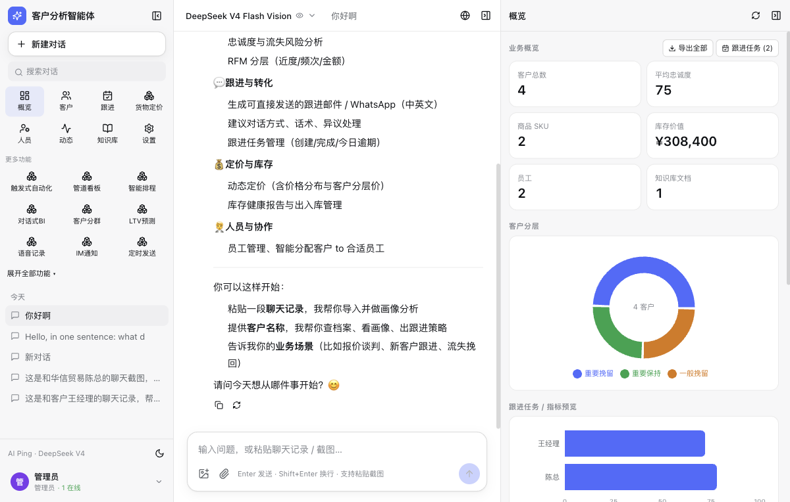
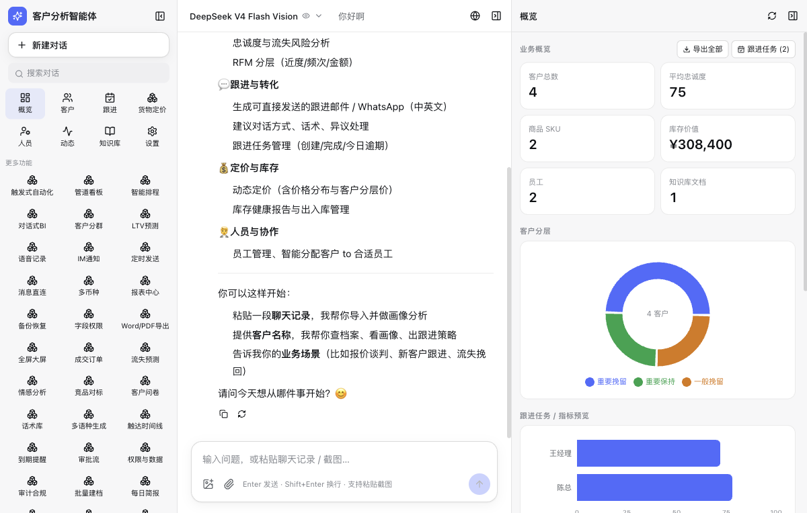
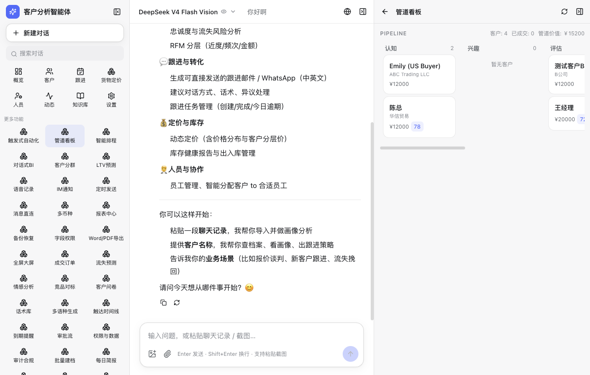
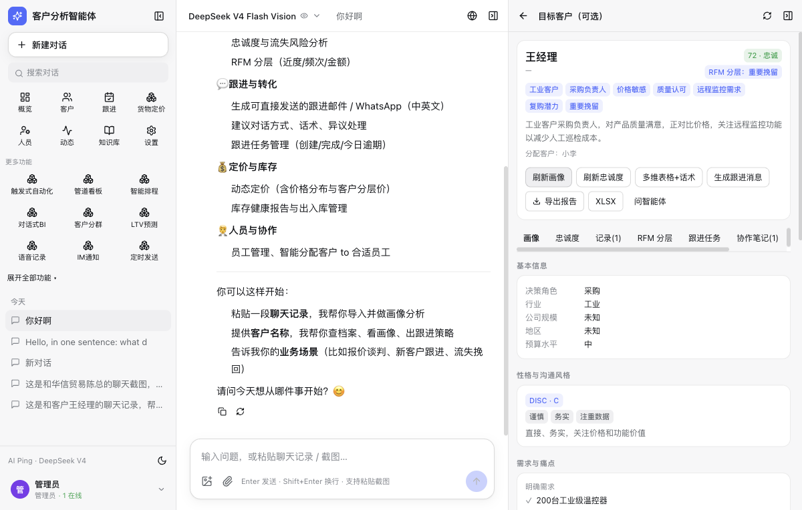

# Customer Analyst · 客户分析智能体

> An **AI customer-analytics platform** that turns customer chats into **revenue insights** — powered by **AI Ping / DeepSeek** multi-models, built for foreign-trade & sales teams.

[](LICENSE)
[](https://nodejs.org)
[](https://github.com/liyixuan201211/customer-analyst)

## What is this

A **three-column** AI customer-analytics agent app (interaction inspired by Open WebUI / DeepSeek Harness) for sales & customer-success teams. It lets you:

1. **Import chats or screenshots** → auto-detect & profile customers (WeChat/QQ/DingTalk/anything, or paste/upload screenshots — a multimodal model transcribes them line by line)
2. **Knowledge-base search + web search** → grounded in your docs and up-to-the-minute industry info
3. **Deep customer profiling + loyalty analysis** (DISC, needs/pain points, decision chain, 6-dimension loyalty, churn risk)
4. **Multi-dimensional analysis tables + suggested talk** (openers / objection handling / closing scripts)
5. **Dynamic pricing** + inventory & personnel management
6. **Advanced analytics**: RFM segments, churn prediction, sentiment, anomaly detection, LTV, customer clustering
7. **CRM loop**: follow-up tasks, trigger-based automation, pipeline kanban, daily brief
8. **Multi-channel**: zh/en UI, follow-up email/WhatsApp generation (es/fr/de/ru/ar/pt/ja), CSV/XLSX/Word reports, PWA, IM notifications

> 36+ features, all mounted on an extensible `features/` registry: each feature = one backend REST module + one frontend panel. Plug-and-play.

## Screenshots

| Overview / Dashboard | Data Big Screen |
|---|---|
|  |  |

| Pipeline Kanban | Customer Profile |
|---|---|
|  |  |

## Architecture

```
analyst/
├── server/                 Node 24 + Hono (node:sqlite, zero native deps)
│   └── src/
│       ├── db/             data layer (conversations/customers/kb/tables/products/staff/orders/approvals/automation…)
│       ├── llm/aiping.js   AI Ping client: chat/stream/vision/image/embedding + model registry
│       ├── agent/          multi-turn tool loop + SSE streaming + 24 agent tools
│       ├── features/       36 feature modules (REST sub-routers), registered centrally
│       ├── tools/          importer / knowledge / web / analysis / pricing / report
│       └── routes/api.js   REST + SSE + auth middleware + users/collaboration
├── web/                    React 19 + Vite + Tailwind 4 + Zustand + recharts
├── data/                   SQLite database (runtime only, not in repo)
├── .env.example            AI Ping config template
└── start.sh                one-command build + serve
```

- **Models**: AI Ping (DeepSeek-V4-Flash-Vision-Exp default: chat + multimodal + tool calls; 140+ models selectable)
- **Multi-user**: register/login (scrypt + session tokens), admin/member roles, team activity feed, collaboration notes, approval flow, field-level permissions
- **i18n**: zh-CN / English (es/fr/de/ru/ar/pt/ja fall back to English)

## Run (out of the box)

```bash
cp .env.example .env        # put your AI Ping API key (https://aiping.cn)
pnpm install
pnpm build
pnpm start                  # http://127.0.0.1:3090
```

Or with Docker (single command):
```bash
docker compose up --build
```

Default account: `admin / admin123` (change it in Account after first login). Optional: `node server/seed.js` to create demo data.

Dev mode (HMR):
```bash
pnpm dev                    # frontend :5190 proxies to backend :3090
```

## Model switching

Default **DeepSeek-V4-Flash-Vision-Exp** (chat / OCR / tool-calling). Switch in right-panel Settings, or type any AI Ping model ID; the header model picker switches per conversation.

## Features (36)

- **Core**: chat import (text/OCR), knowledge base (vector+full-text), web search, deep profile, loyalty, multi-dim tables + scripts, dynamic pricing, inventory/personnel
- **Advanced**: real orders (RFM monetary), churn prediction, sentiment, anomaly detection, competitor benchmark, scripts library, NPS surveys, multilingual generation, contact timeline, reminders, approval flow, permissions/data isolation, audit & compliance, batch import, daily brief, conversation tags, multi-agent, webhooks/open API, PWA, data big screen
- **Batch 2**: trigger-based automation (IFTTT), pipeline kanban, smart follow-up scheduling, conversational BI, customer clustering, LTV prediction, voice notes (optional ASR), IM notifications (DingTalk/WeCom/Telegram), scheduled send + receipts, message ingress, multi-currency FX, report center + scheduled weekly/monthly, full backup/restore, field-level permissions, Word/PDF export, fullscreen big screen

## Contributing

Issues & PRs welcome. To add a feature, use the `features/` registry (`server/src/features/<id>.js` + `web/src/panels/features/<id>.jsx`).

## License

[MIT](LICENSE)
